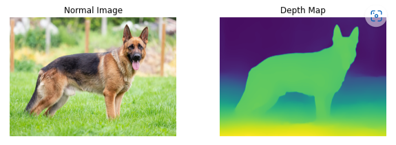

# MiDaS-Depth-Map

Midas is a machine learning model that estimates depth from an arbitrary input image. MiDaS computes relative inverse depth from a single image and was trained on up to 12 datasets (ReDWeb, DIML, Movies, MegaDepth, WSVD, TartanAir, HRWSI, ApolloScape, BlendedMVS, IRS, KITTI, NYU Depth V2) with multi-objective optimization. Image below shows an overview of an input image and its depth map.
<p align="center"></p>

## Guide
Clone this repo and cd into it

Create and activate a virtual environment.

```
python -m venv MiDaS_venv
.\MiDaS_venv\Scripts\activate
```
#### Install Requirements

Install appropriate pytorch package

```
pip install -r requirements.txt
```

#### Test on image

```
python depth_map.py --model DPT_Large --source img.png --save out.png
```

#### Test on video

```
python depth_map.py --model DPT_Large --source corridor_video.mp4 --save corridor_video_depth_map.mp4
```

```
python depth_map.py --model DPT_Large --source escalator_video.mp4 --save escalator_video_depth_map.mp4
```

#### NB: Check demo folder for results of inference on videos
